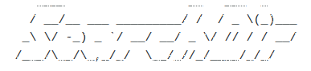

# Search-Directories

<code></code>

## O SearchDir é uma ferramenta de hacking simples para escanear diretórios nos sites!

## Instruções
1. Clone o repositório
  * `git clone https://github.com/PatrickR00t/Search-Directories.git`
  * Entre na pasta do repositório que você acabou de clonar:
    * `cd Search-Directories`

2. Para usar esta ferramenta, basta digitar:
   * `python3 SearchDir.py`
